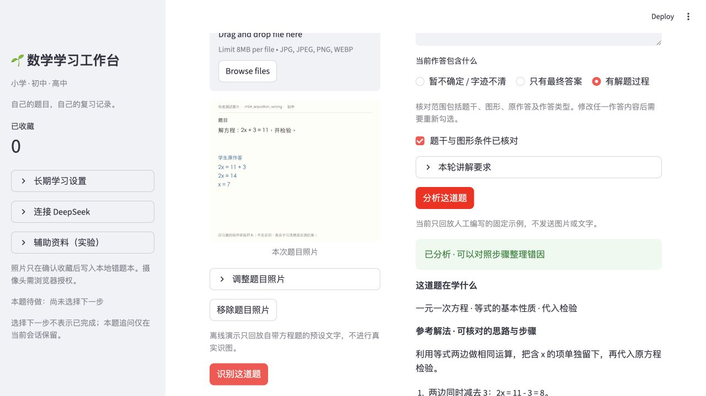
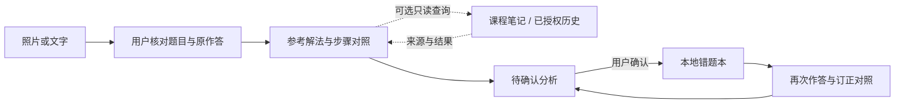

# Math Learning Agent · 数学错题助手

面向 K12 数学的本地学习原型：上传题目与作答，核对文字，查看参考解法和学生步骤对照，再由用户决定是否存进错题本。重新作答时保留订正前后的记录，便于按知识点回顾。

**固定编排为主，另有默认关闭的有限只读工具调用。** 开启后，模型可在预算内选择查询自写课程笔记或已授权的错题历史；程序校验请求、来源和结果，模型不能自行保存、修改文件或标记掌握。使用 Python、Streamlit、DeepSeek Chat Completions 与本地 JSON，Codex 辅助开发。



*截图来自项目离线演示：自写合成题目、预设回复、零模型请求。没有真实学生照片或个人错题记录。*

## 主要流程

1. 分别上传题目和学生作答，或直接输入文字；照片可旋转、裁剪。
2. 核对题干、图形条件和原作答，保留学生原来的错误，不把教师批注当学生步骤。
3. 对照参考解法与学生步骤，查看带原文证据、仍需核对的错因假设。
4. 用户确认后收藏；再次作答时查看变化，选择保存或放弃订正。
5. 按知识点回顾、导出记录，并支持从回收站恢复。

只有答案时不猜中间算法，条件不足时先询问。长期设置、本轮临时要求、同题追问与历史授权分别管理。接受下一步不等于完成，一次答对不自动表示掌握。



## 无密钥体验

```bash
git clone https://github.com/03jiang/math-learning-agent.git
cd math-learning-agent
python3 -m venv .venv
source .venv/bin/activate
python -m pip install -r requirements-lock.txt
python -m study.launch --demo
```

打开终端显示的地址，默认是 [127.0.0.1:8518](http://127.0.0.1:8518/)。端口占用时加 `--port 8520`。

点击“载入演示题”，核对并分析，再点“确认加入错题本”。进入错题本，点击“填入演示订正”，即可体验分析、放弃、保存和恢复。演示只回放固定自写样例，不做真实 OCR、不调用模型，也不给任意新题目编造回复。演示存档独立保存在 `data/demo-study/`。

真实模式使用 `python -m study.launch`，在侧栏隐藏输入密钥，详见 [API 配置](API_SETUP.md)。主动点击相关按钮才请求；可能产生费用，失败不自动重试。当前支持 macOS / Linux，文件锁实现不支持 Windows 原生运行。

## 评估与已知限制

- **评估框架与离线协议验证已完成。** A 为规则触发查询的固定流程，B 为有限只读工具循环。框架包含 30 个合成案例、15 个题目家族，划分为 20 条开发案例与 10 条保留案例，涵盖多轮设置、只给答案、等价解法、条件不足和预设故障。离线使用本机手写 HTTP 响应验证协议与执行流程，不作为模型教学质量分。
- **AI 预审已完成 47 个开发集回合。** 这是助手对已采集回复的逐条预审，不是教师评分。该快照的 58 个计划回合中，47 完成、7 失败、1 阻塞、3 未运行；完成仅表示协议校验完成。已发现局部运算与整体方法判断混淆、提示给得过多、部分来源使用不够贴切等问题。详见 [评估范围与证据](docs/EVALUATION_STATUS.md)。
- **人工评分未完成。** 不报告人工准确率、学生学习提升或 B 优于 A 的结论。真实手机手写照片、真实学生使用和广泛题目质量仍待验证。

这是单机、单用户原型，没有在线账号服务或学习效果研究。完整原始调用日志、个人照片和错题本不在公开仓库中。

## 代码与说明

| 入口 | 内容 |
|---|---|
| [`app.py`](app.py)、[`study/`](study/) | 新版界面、分析协议、错题本、订正、上下文与工具循环 |
| [`tests/`](tests/) | 新版及 legacy 全量离线回归测试 |
| [`legacy/`](legacy/) | 早期四题原型、旧入口与仍复用的兼容模块 |
| [`evaluation/agent_ab_v1/`](evaluation/agent_ab_v1/) | A/B 案例、冻结划分和逐回合评分标准 |
| [`evaluation/photo_cases_v1/`](evaluation/photo_cases_v1/) | 自写程序排版图片样例，不是实际学生照片 |
| [`docs/ARCHITECTURE.md`](docs/ARCHITECTURE.md) | 保存边界、状态与关键代码 |
| [`docs/AGENT_LOOP.md`](docs/AGENT_LOOP.md)、[`docs/CONTEXT.md`](docs/CONTEXT.md) | 有限工具循环、设置及同题追问 |
| [`docs/PRODUCT.md`](docs/PRODUCT.md)、[`docs/DEMO.md`](docs/DEMO.md) | 产品取舍与演示步骤 |
| [`tools/export_public.py`](tools/export_public.py) | 明确白名单导出，排除密钥和私人运行数据 |

```bash
python -m study.launch --demo --check
python -B -m unittest discover -v
```

全量测试使用临时存档、合成图和本机 HTTP 响应，不需要模型密钥。Ubuntu 需安装 `fonts-noto-cjk`；macOS 使用系统中文字体。GitHub Actions 用锁定依赖执行相同检查。

JSON 写入采用文件锁、原子替换、版本检查与重复操作去重。上传、识别草稿和模型回复不会自动写入错题本。公开内容由 `tools/public_files.json` 列出，文件校验值记录在 `PUBLIC_MANIFEST.json`。

**English:** A local, learner-confirmed math review prototype. Primarily a fixed workflow, with an opt-in bounded read-only tool loop. Offline comparisons and AI-assisted review are available; human scoring and learning-outcome evaluation are incomplete.
