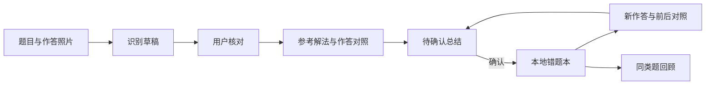

# Math Learning Agent · 数学学习与错题复盘助手

新增 [有限只读工具循环](docs/AGENT_LOOP.md)：主页面分析和订正可选择查课程笔记或已收藏历史，带调用预算、来源追踪和用户确认。默认关闭，已做离线工程验证，真实工具决策与教学效果尚未验收。原有 [文字验证入口](docs/STUDY_SMOKE.md) 继续保留。

当前已完成一个真实文字订正保存与恢复闭环，以及两张合成图片的真实 OCR 和分析。照片分析中发现两处内容缺陷，本轮加入离线证据规则与回归测试；新版尚未真实回归，照片教学质量和收藏闭环未验收。详见[当前状态](docs/STATUS.md)及[分析证据检查](docs/ANALYSIS_EVIDENCE.md)。仓库保持私有。

面向 K12 数学学习的本地产品原型：把题目、学生作答、参考解法和订正历史放在同一个学习流程中，帮助学生看见差异、理解依据、留下可复习的总结。

**这是有人参与确认的 AI 学习工作流，默认单次分析，可选有限只读工具循环。** Python / Streamlit / DeepSeek Chat Completions / JSON。使用 Codex 辅助开发；工程验证与教学效果分开陈述。

## 三分钟了解

1. 上传题目照片，可另外上传作答照片；支持旋转、裁剪和直接输入文字。
2. 核对题干、图形条件、学生原作答及类型，避免把错误答案或教师批注当题干。
3. 查看参考解法与学生步骤对照、引用原文的错因假设、知识点和自检建议。
4. 确认后收进错题本；再次作答，查看前后变化，决定保存或放弃订正。
5. 按知识点回顾、导出记录，误删的题目可从回收站恢复。

只有最终答案时不推断错误过程；条件不足先澄清；一次答对不自动标为掌握。模型提出分析，程序校验结构与引用，用户决定保存。



## 无密钥运行

已在 macOS / Python 3.12 验证。Linux 测试由 GitHub Actions 执行，结果以仓库 Actions 页面为准；Windows 暂不支持 `fcntl` 文件锁。

当前私有仓库的克隆需要已获授权的 GitHub 账号。

```bash
git clone https://github.com/03jiang/math-learning-agent.git
cd math-learning-agent
python3 -m venv .venv
source .venv/bin/activate
python -m pip install -r requirements-lock.txt
python -m study.launch --demo
```

打开终端显示的本地地址，默认 [127.0.0.1:8518](http://127.0.0.1:8518/)。端口占用可加 `--port 8520`。点击“载入演示题” → 核对 → 分析 → 收藏 → 在错题本“填入演示订正” → 核对、分析、确认保存或放弃。

**演示模式只回放一道人工作答样例，不执行 OCR、不调用模型，也不为任意新题目编造回复。** 数据保存在独立的 `data/demo-study/`。真实模式运行 `python -m study.launch`，在侧栏隐藏输入密钥；点击识图、分析或订正分析才发送当前题目内容，不自动重试。真实照片流程尚未验收，见 [验证状态](docs/STATUS.md)。

## 产品岗位阅读入口

- [产品定义、优先级与指标设计](docs/PRODUCT.md)
- [五分钟演示脚本](docs/DEMO.md)
- [系统边界、状态与失败处理](docs/ARCHITECTURE.md)
- [工具循环、零密钥演练与关键代码](docs/AGENT_LOOP.md)
- [五场景真实联调计划与预算边界](docs/AGENT_LIVE.md)
- [实际验证、证据分级与待办](docs/STATUS.md)
- [简历条目与面试准备](portfolio/APPLICATION_PACK.md)

## 测试与目录

```bash
python -m unittest discover -v
```

测试使用临时存档、合成图片和本机 HTTP 手写响应，**不需要模型密钥，不产生真实 API 请求**。图片测试需要中文字体：macOS 使用 STHeiti；Ubuntu 安装 `fonts-noto-cjk`。CI 安装同一份锁定依赖后运行全量测试。

| 目录 / 文件 | 内容 |
|---|---|
| `study/` | 图片、分析协议、错题存储、订正对照与界面 |
| `test_*.py` | 核心、页面、HTTP、持久化与发布边界测试 |
| `evaluation/photo_cases_v1/` | 13 张程序排版的自写题，评分为空；不是实际学生照片 |
| `evaluation/`、`prompts/` | 原四题模块的成对提示词评估脚手架 |
| `docs/`、`portfolio/` | 产品说明、演示、验收边界与求职材料 |
| `tools/export_public.py` | 按明确清单生成公开源码，排除个人存档与运行报告 |

每题 JSON 保存原作答、分析来源、订正历史和操作版本。写入使用文件锁与原子替换，重复操作去重，旧版本建议拒绝。上传、预览和模型回复不自动写入错题本。源码交付包不包含用户照片或密钥，图片样例全部自写合成。

目前是单机单用户原型，没有部署在线服务、账号系统或学生学习效果研究。GitHub 展示源码与产品设计，不等于已上线教育产品。

**English:** A learner-confirmed math review workflow: separate problem and student-work input, evidence-grounded comparison, explicit notebook saves, correction history, and topic review. The deterministic offline demo makes no model calls. Live photo quality and learning outcomes remain unverified.
