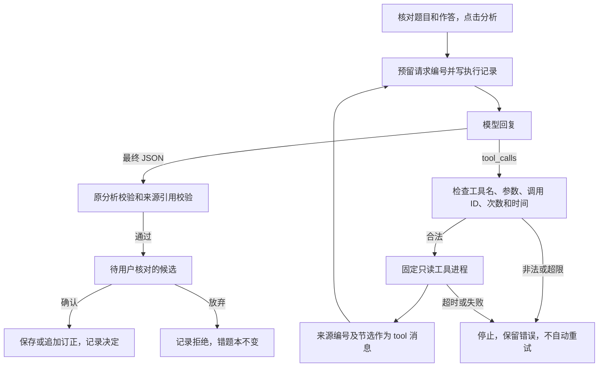

# 有限只读工具循环：实现与验收

阶段 C 的程序已接入拍照解题和再次订正页面，默认关闭。本轮完成本机 HTTP、页面和文件持久化验证，新增真实模型请求为 0。**真实模型是否恰当选择工具、来源是否支持教学结论，尚未验收。** 不能把手写工具请求称为真实 Agent 效果。

## 从页面进入

当前代码位于草稿 PR 分支 `feat/study-smoke-audit`，尚未合并到 `main`；下列命令在该分支的仓库根目录执行。

运行 `python -m study.launch`，在侧栏展开“辅助资料（实验）”，开启“让模型按需查资料”。“允许查询已收藏错题”另外选择，默认关闭，两项都只在当前会话生效。核对题目后，原来的“分析这道题”或“分析本次订正”会进入新循环；关闭开关继续使用原来单次分析。OCR 识别不走工具循环。

开启开关本身没有请求；分析按钮每轮最多产生 4 次模型请求，可能增加费用。课程资料来自固定 `notes/`；历史查询只限当前应用的本地错题本。历史关闭时，Agent 不提供历史工具、不预读其他错题正文，也不把它放入请求。页面展示错题本自身仍会读取本地收藏。订正所必需的本题前一次作答和分析属于当前任务上下文，不是跨题历史。

固定题离线演示 `python -m study.launch --demo` 禁用工具开关，保留原来的零请求演示。无密钥检查工具循环请运行下面的独立 HTTP 演练，它使用与页面相同的服务、校验和存储：

```bash
python -B -m tools.demo_study_agent --output evaluation_runs/agent-offline-01
python -B -m unittest test_study_agent test_study_agent_ui -v
python -B -m unittest discover -v
```

输出目录必须不存在；不会覆盖旧报告。演练包含直接回答、查笔记、查无结果、读历史、越权失败、预算用尽、缺条件澄清 7 个场景；工具选择和最终回复均预编。模拟一次拒绝、一次接受与重复确认，独立错题本重读后仍没有掌握标记。`summary.json` 和各场景 `agent-runs/*.json` 可逐条查看，不接真实 API。

## 一轮请求怎样流动



采用 DeepSeek 官方 [Tool Calls](https://api-docs.deepseek.com/guides/tool_calls/) 的 Chat Completions 回合：`assistant.tool_calls` → 程序执行 → 同 ID 的 `role=tool` 消息 → 下一次模型请求。使用 `thinking=disabled` 和 `tool_choice=auto`；名额将尽时改为 `none`。最终正文采用 `json_object`，包装为 `{"result":原分析或订正对象,"citations":[{"source_id":"来源编号","quote":"原文节选"}]}`。本轮只核对官方格式并做本机模拟，当前配置与真实供应商的组合兼容性仍需一次独立批准的联调。

旧 `strict_tool` 是强制输出某个函数参数的格式通道；不执行工具。新循环有独立解析器，不修改旧 `model_api.chat_response_text` 对工具请求的拒绝规则，也不使用 `MockTutor.plan()` 的关键词路由。

## 权限、次数与长度

| 项目 | 当前规则 |
|---|---|
| `search_notes(query)` | 固定笔记目录；复用关键词检索，最多 32 份笔记、每份 ≤64 KiB；最多 3 个结果、每段 ≤360 字符 |
| `get_review_history(topic, limit)` | 固定当前用户目录；最多扫描 200 份 JSON；只返回未归档且相关的最多 3 题；订正时排除当前题 |
| 来源 | 笔记、用户原作答、最近订正、自评、旧模型分析分别标注；历史携带记录编号、时间和节选标识，旧模型分析标为未核对 |
| 参数 | 工具名与字段白名单，查询 ≤200 字符，`limit` 为 1–3 的整数；没有目录参数、写入、执行代码或联网工具 |
| 工具结果 | 每次序列化结果 ≤7,000 字符；引用必须是本轮实际返回来源中的逐字片段；不能证明引用在语义上支持结论 |
| 调用上限 | 每轮至多 3 次工具执行、4 次模型请求；同批多个、重复、失败请求均计入工具请求数；超限批次整批不执行 |
| 时间 | 本地工具累计 ≤3 秒，固定子进程到时终止；全轮 ≤180 秒，单次模型 ≤60 秒且不超过配置和全轮剩余时间 |
| 终态 | 成功、需要澄清、工具失败、预算用尽，或回复校验失败；无自动重试和模型降级重试 |
| 缓存与过期 | 页面重绘复用已完成调用；拒绝或失败不会自行重发；候选 24 小时过期；切换历史权限、资料变化使旧候选失效 |

文件元信息签名用于发现来源新增、修改、归档与恢复，不等同于内容可信度或语义时效性。相关性仍是关键词匹配，时间只用于相关性同分时优先较新记录；过时知识判断、查询质量评估及完整上下文预算属于后续 D/E。单机固定进程实现只读接口，未提供操作系统级沙箱或云端多租户隔离。

## 执行记录与用户确认

普通模式执行记录保存在 `data/study/agent-runs/`，与 `data/study/notebook/` 分开；自定义数据目录下也按同样的同级结构保存。记录包含题目/作答文字、代码提交、提示词哈希、请求编号、参数、用量（缺失时未知）、工具调用与来源、最终结果、停止原因和用户决定。图片只记哈希，不存原图；不记录密钥和 `reasoning_content`。这些仍是私人学习数据，公开导出排除它们。

页面的“本次资料查询记录”可查看请求、工具、来源与终态，最终分析仍显示在原来的步骤对照区。执行日志在发送前预留编号；已有编号即使停在 running 也不续发。模型超时可能仍被供应商计费，不能声称失败等于零调用。未确认不会改错题本；执行日志用于追踪调用，不算收藏。

保存前重新检查候选哈希、拒绝状态、过期时间和来源版本，然后调用现有 `Notebook` 的版本校验、操作 ID 去重与原子写入，最后记录用户决定与保存的题目/订正编号。日志和错题本是两个文件事务；若题目已经保存但决定日志写入失败，界面提示核对执行记录，不把它宣称为整体回滚。重复确认不追加订正，自评和掌握不由模型更新。

## 需要理解的代码

| 文件 | 要能解释的问题 |
|---|---|
| `study/agent.py` | 模型为什么能选择直接回答或工具；预算如何跨回合累计，在哪里停止 |
| `study/agent_protocol.py` | 最终正文与工具分支如何分开；怎样防止调用 ID、参数和引用不匹配 |
| `study/agent_tools.py` | 为什么模型传不进任意目录；关闭历史、回收站与当前题排除在哪里执行 |
| `study/agent_audit.py` | 请求预留、候选过期、用户决定与实际收藏为什么分开 |
| `study/agent_ui.py`、两个 `*_ui.py` | 同一服务怎样接入分析和订正；为什么重绘、拒绝不会再次发送 |
| `test_study_agent.py`、`test_study_agent_ui.py` | 哪些是程序保证，哪些只是手写模型响应，不能据此报教学效果 |

本轮不能勾选清单中的“真实模式演示五类工具决策”。后续需单独冻结请求范围、确认预算后验证真实选择，再按 D 接通本轮要求、已确认设置、同题追问和上下文预算，最后开展 E 的对照评估与人工评分。既有两次照片分析的内容缺陷、未收藏状态和 B 阶段原始账本保持不变。
