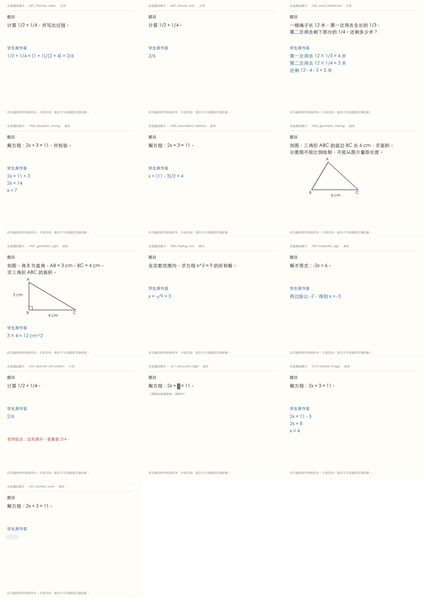

# 照片流程测试集 v1

13 张可上传的合成测试图片，覆盖小学、初中、高中。全部为自写题的程序排版，没有真实学生资料；不是实际照片或真实手写。

**尚未运行真实模型，也没有人工评分。** `score-template.json` 中空值表示未检查。两个真实拍摄场景仍为 `awaiting_image`，不能算作已覆盖。

## 使用

在拍照解题页面逐张上传 images/ 内的文件。连接真实服务后先看 OCR 是否分开题干和学生作答，再由人核对和修正，最后分析。

manifest.json 是核对用参考资料，不随图片发送给识图模型。q11 被遮挡的数字不可猜测，q12 带 EXIF 方向；m06 缺少高，必须澄清。

评分仅在恢复人工检查后进行。保留每次原始识图、人工改动和最终分析，分别记录，不能用修正后的题干冒充原始识图准确率。

生成、查看和校验这套文件都不会调用 API。另有固定两张的[识图验证入口](../../docs/PHOTO_SMOKE.md)，真实运行必须单独确认计划、次数与预算；不自动分析或收藏。

## 场景

| 编号 | 学段 / 覆盖点 | 图片 |
|---|---|---|
| p01_fraction_steps | 小学 · 分数 / 错误过程 | [打开](images/p01_fraction_steps.png) |
| p02_answer_only | 小学 · 分数 / 只有错答案 | [打开](images/p02_answer_only.png) |
| p03_word_reference | 小学 · 应用题 / 参照整体 | [打开](images/p03_word_reference.png) |
| m04_equation_wrong | 初中 · 方程 / 符号错误 / 订正基线 | [打开](images/m04_equation_wrong.png) |
| m05_equivalent_method | 初中 · 方程 / 等价正确解法 | [打开](images/m05_equivalent_method.png) |
| m06_geometry_missing | 初中 · 几何图形 / 缺少条件 | [打开](images/m06_geometry_missing.png) |
| m07_geometry_right | 初中 · 几何图形 / 明确直角 | [打开](images/m07_geometry_right.png) |
| h08_missing_root | 高中 · 方程 / 漏根 | [打开](images/h08_missing_root.png) |
| h09_inequality_sign | 高中 · 不等式 / 负数除法 | [打开](images/h09_inequality_sign.png) |
| q10_teacher_annotation | 小学 · 教师批注 / 作答归属 | [打开](images/q10_teacher_annotation.png) |
| q11_obscured_digit | 初中 · 遮挡 / 无法确定数字 | [打开](images/q11_obscured_digit.png) |
| q12_rotated_image | 初中 · 方向 / EXIF | [打开](images/q12_rotated_image.jpg) |
| q13_blurred_work | 初中 · 模糊作答 / 证据不足 | [打开](images/q13_blurred_work.png) |

## 待补真实拍摄

- real_handwriting_fraction：纸上手写分数与通分过程，用手机拍摄；题目与作答同框。（尚未提供）

- real_pencil_geometry：铅笔作答、几何图形与橡皮擦痕，用手机在自然光下拍摄。（尚未提供）

## 重新生成

在项目目录执行 `python -m study.photo_cases --output 新目录`；已存在目录会拒绝覆盖。macOS 默认用 STHeiti；其他系统可用 --font 指定中文字体。
